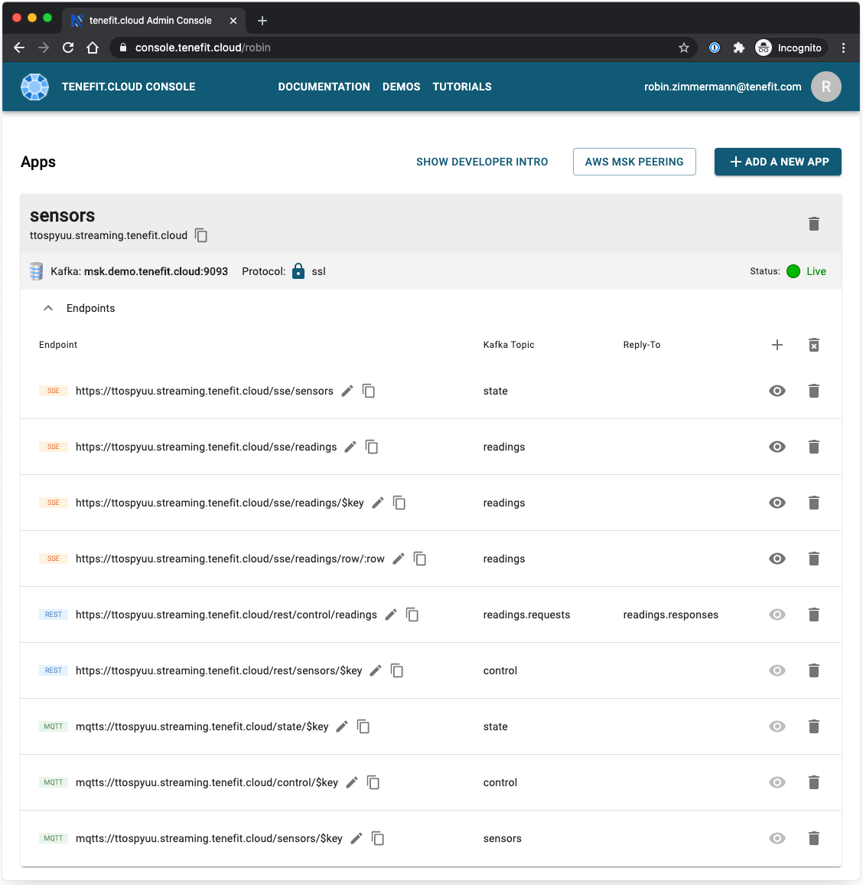

# Sensors end-to-end demo

This README contains instructions for running the full sensors demo end-to-end.

In this demo you will be taken through how to integrate Kafka and MQTT clients, such as IoT devices, but without the need for additional architectural components like a cluster of MQTT broker and Kafka Connect.

Rather than physical IoT devices, the demo will simulate them using a Java-based MQTT clients acting as a temperature sensors. You will connect those sensors to tenefit.cloud, and see them integrate with a backend microservice and a frontend browser application – all without any need for coding.

These instructions also contain an optional chapter that demonstrates integrating MQTT clients with Kafka via a physical MQTT broker and Kafka Connect. Prior to tenefit.cloud this would have been one of the main options considered by architects.

The optional sections are marked, so if you just want to see the portion of the demo that has MQTT clients integrating with Kafka via tenefit.cloud, you skips those optional steps. They will be marked as _"optional for Kafka Connect"_

## Contents

- [Prerequisites](#prerequisites)
- [One-time setup](#one-time-setup)
- [Pre-demo setup](#pre-demo-setup)
- [Running the demo](#running-the-demo)
- [Post-demo cleanup](#post-demo-cleanup)

## Prerequisites

- Java 1.8 or higher

- A Kafka broker or Kafka broker cluster

Optional for Kafka Connect:

- Docker and Docker Compose

## One-time setup

The steps in this section only need to be done once to setup and install the necessary components in your environment.

1. Stand up a Kafka broker or Kafka broker cluster with the following topics pre-created and configured:

   | topic                | cleanup.policy                |
   | -------------------- | ----------------------------- |
   | `sensors`            | `compact` or `compact,delete` |
   | `readings`           | `compact` or `compact,delete` |
   | `readings.requests`  | `delete`                      |
   | `readings.responses` | `delete`                      |
   | `state`              | `compact` or `compact,delete` |
   | `control`            | `delete`                      |

   Note:

   - The `sensors`, `readings`, and `state` topics are log compacted.

   - As usual, when manually creating topics in Kafka, ensure that the topic's replication factor is greater than or equal to the broker's `min.insync.replicas` setting.

   The remainder of this document will use the address `kafka.example.com` for your Kafka.

1. Clone or fork this repo.

1. You need to build the MQTT sensor IoT thing. In a terminal window, change to the top level directory of this repo. You'll know you're in the right directory if you see the `pom.xml` file:

   ```
   $ ls pom.xml
   pom.xml
   ```

1. Run the following command to build the Java-based MQTT sensor application using Maven:

   ```
   $ ./mvnw clean install
   ```

   The very first time you ever run that command, it may take a minute to pull down library dependencies and cache them locally. Thereafter, whenever you run that command it should only take a few seconds.

1. The temperature converter microservice will also need to be built before it can be run. It can be found in a separate repo.

   In a new terminal window, fork or clone the https://github.com/tenefit/microservice-temperature-converter.java repo.

1. Run the following command to build the Java-based microservice using Maven:

   ```
   $ ./mvnw clean install
   ```

   The very first time you ever run that command, it may take a minute to pull down library dependencies and cache them locally. Thereafter, whenever you run that command it should only take a few seconds.

1. Finally, you need to configure tenefit.cloud. Open https://console.tenefit.cloud/ in a browser. You will first need to sign up for an account, if you haven't already. It's free and there are no commitments required.

1. Once you are logged in, click the **Add a new app** buton. In the dialog that appears, select **Direct**.

   Use any name you like for the **Name of your broker** field. It's useful to give a name related to the functionality you'll be using it for, so `sensors` is probably a good name.

   Select the protocol. `plaintext` is recommended for simplicity, if your broker supports it.

   Enter the address of your broker or cluster in the **Kafka cluster or domain name** field, e.g. `kafka.example.com`.

   Verify that the **Port** is correct, and hit **Test connection**.

   Once the verification is complete, click **Done**.

1. Click the **Delete all endpoints** icon to remove the endpoints that were automatically generated for you based on the topics in your Kafka. The **Delete all endpoints** icon is in the header row, on the right-hand side.

1. Click the **Add a new endpoint** icon (the `+` icon) to add a new endpoint. Use the table below to add all of the endpoints required for the demo. Since new endpoints are added to the top of the list, you may want to create the endpoints starting from the bottom of the table. Otherwise you can re-order them later.

   | type          | path                   | topic             | reply-to           |
   | ------------- | ---------------------- | ----------------- | ------------------ |
   | SSE           | /sse/sensors           | state             |                    |
   | SSE           | /sse/readings          | readings          |                    |
   | SSE           | /sse/readings/\$key    | readings          |                    |
   | SSE           | /sse/readings/row/:row | readings          |                    |
   | REST          | /rest/control/readings | readings.requests | readings.responses |
   | REST          | /rest/sensors/\$key    | control           |                    |
   | MQTT over TLS | /state/\$key           | state             |                    |
   | MQTT over TLS | /control/\$key         | control           |                    |
   | MQTT over TLS | /sensors/\$key         | sensors           |                    |

   After each change, the status tell you it's updating. It is okay to keep adding endpoings while the status is updating. You don't need to wait for the green **Live** status each time.

   Here is a screenshot of how your endpoints should look when you are done:

   

1. Take note of the temporary domain you've been allocated by the tenefit.cloud console. You can see it each of the endpoints. You can also see it in the top of the table, under the name of your configuration.

   It will be something like:

   ```
   ttospyuu.streaming.tenefit.cloud
   ```

   You will need to use the domain name later when you run the demo.

The remaining steps in this section are optional for using Kafka Connect:

1. Using an editor, open `docker-compose.yml`.

   - Change `kafka.example.com` to the address of your Kafka broker or cluster.
   - If your Kafka requires the client to use a keystore or truststore, remove the comments from the environment variables prefix with `CONNECT_SECURITY_*`, `CONNECT_SSL_*`, `CONNECT_PRODUCER_SECURITY_*`, and `CONNECT_PRODUCER_SSL_*`, and set the appropriate values.
   - Save the file.

1. Using an editor, open `connect-mqtt-sensors.json`.

   - Change `kafka.example.com` to the address of your Kafka broker or cluster.
   - If your Kafka requires the client to use a keystore or truststore, change `confluent.topic.security.protocol` from `PLAINTEXT` to `SSL` and provide the appropriate SSL settings, for example:

     ```json
     "confluent.topic.ssl.truststore.location": "/var/private/ssl/truststore.jks",
     "confluent.topic.ssl.truststore.password": "change-this-password",
     "confluent.topic.ssl.keystore.location": "/var/private/ssl/keystore.jks",
     "confluent.topic.ssl.keystore.password": "change-this-password",
     "confluent.topic.ssl.endpoint.identification.algorithm": "",
     ```

   - Save the file.

1. Using an editor, open `connect-mqtt-state.json`.

   - Change `kafka.example.com` to the address of your Kafka broker or cluster.
   - If your Kafka requires the client to use a keystore or truststore, change `confluent.topic.security.protocol` from `PLAINTEXT` to `SSL` and provide the appropriate SSL settings, for example:

     ```json
     "confluent.topic.ssl.truststore.location": "/var/private/ssl/truststore.jks",
     "confluent.topic.ssl.truststore.password": "change-this-password",
     "confluent.topic.ssl.keystore.location": "/var/private/ssl/keystore.jks",
     "confluent.topic.ssl.keystore.password": "change-this-password",
     "confluent.topic.ssl.endpoint.identification.algorithm": "",
     ```

   - Save the file.

1. In the same directory, start the Docker Compose suite that will run the Eclipse Mosquitto MQTT broker and Apache Kafka Connect:

   ```
   $ docker-compose up
   ```

   You'll need to wait between one and two minutes for everything to start. It's ready when you generally see the logging stop scrolling.

   Often, the following lines indicate that the Docker containers are ready:

   ```
   mosquitto | 1588138801: New connection from 10.8.8.3 on port 1883.
   mosquitto | 1588138801: New connection from 10.8.8.3 on port 1883.
   mosquitto | 1588138801: New client connected from 10.8.8.3 as paho7385846549894 (p2, c1, k60).
   mosquitto | 1588138801: New client connected from 10.8.8.3 as paho7385846530194 (p2, c1, k60).
   ```

1. Each Kafka Connector needs to be configured once.

   First the sensors connector:

   ```shell
   $ curl \
     --header "Content-Type: application/json" \
     --header "Accept: application/json" \
     --request PUT \
     --data @connect-mqtt-sensors.json \
     http://localhost:8083/connectors/mqtt-source-sensors/config
   ```

   This will take around 30 seconds, and you'll know it's down when the Docker logs generally stops scrolling.

1. Then the state connector:

   ```shell
   $ curl \
    --header "Content-Type: application/json" \
    --header "Accept: application/json" \
    --request PUT \
    --data @connect-mqtt-state.json \
    http://localhost:8083/connectors/mqtt-source-state/config
   ```

   This will take around 30 seconds, and you'll know it's down when the Docker logs generally stops scrolling.

## Pre-demo setup

Go through these steps prior to each occasion you want to run the demo.

1. The temperature converter microservice needs to be started. In a new terminal window, go the location you forked or cloned the https://github.com/tenefit/microservice-temperature-converter.java repo, and run the following command:

   ```shell
   $ java -jar target/microservice-temperature-converter-develop-SNAPSHOT.jar \
      -b kafka.example.com:9092 \
      --input-topic sensors \
      --output-topic readings \
      --requests-topic readings.requests
   ```

The remaining steps in this section are optional for using Kafka Connect:

1. Open a terminal window and go to the top-level directory from this repo. To check that you're in the right directory, make sure you see the `docker-compose.yml` file:

   ```
   $ ls docker-compose.yml
   docker-compose.yml
   ```

1. The Docker Compose suite that will run the Eclipse Mosquitto MQTT broker and Apache Kafka Connect needs to be started, if you don't already have it running:

   ```
   $ docker-compose up
   ```

   You'll need to wait between one and two minutes for everything to start. It's ready when you generally see the logging stop scrolling.

   Often, the following lines indicate that the Docker containers are ready:

   ```
   mosquitto | 1588138801: New connection from 10.8.8.3 on port 1883.
   mosquitto | 1588138801: New connection from 10.8.8.3 on port 1883.
   mosquitto | 1588138801: New client connected from 10.8.8.3 as paho7385846549894 (p2, c1, k60).
   mosquitto | 1588138801: New client connected from 10.8.8.3 as paho7385846530194 (p2, c1, k60).
   ```

## Running the demo

1. Start the MQTT sensors by opening a terminal window to the top-level directory where you cloned/forked this repo.

   You'll need to use the domain name you were allocated by the tenefit.cloud console. To start the sensors, replace `ttospyuu.streaming.tenefit.cloud` with your domain in the following command:

   ```bash
   $ java -jar target/thing-temperature-sensor-develop-SNAPSHOT.jar \
       -b mqtts://ttospyuu.streaming.tenefit.cloud \
       --sensors 10 \
       --rows 3
   ```

1. Open the tenefit.cloud Console in a browser: https://console-staging.tenefit.cloud/. Sign in, if required.

1. Find the SSE endpoint with the path `/sse/readings` and click the live preview icon on the right (it looks like an eye). You will a stream of readings broadcast from the microservice. This is an easy way to verify that you have your configuration correct.

1. Press the live preview icon again to close it.

1. Find the SSE endpoint with the path `/sse/readings/$key` and click the live preview button.

   The `$key` is a token that means the Kafka message key. In this sensors demo, the message key is the sensor id. Under the preview box there is a text field labeled **\$key**. Type in `1` and hit enter. You will see the readings from sensor 1.

1. Press the live preview icon again to close it.

1. Find the SSE endpoint with the path `/sse/readings/row/:row` and click the live preview button.

   The `:row` is a token that represents the header name you want to filter on. Messages from the sensor have a header called `row` with a value for the row they are in.

   In the **:row** text field under the preview box, type `3` and hit enter.

   You are now filtering only for messages that have a header called `row` with a value of `3`.

1. Press the live preview icon again to close it.

1. The tenefit.cloud console is for managing and verifying your configuration. Now let's see those endpoints being used in a real end user application.

   Before we can do that, you will need to note the temporary domain you've been allocated by the tenefit.cloud console. You can see it each of the endpoints. You can also see it in the top of the table, under the name of your configuration.

   It will be something like:

   ```
   ttospyuu.streaming.tenefit.cloud
   ```

   Copy your domain name (not `ttospyuu.streaming.tenefit.cloud`!), insert it into the following URL, and open it in a browser:

   ```
   https://demo.tenefit.cloud/?domain=ttospyuu.streaming.tenefit.cloud#sensors
   ```

   Be sure that you put your domain name after the `domain=` and before the `#sensors`.

1. Once you are in the sensors portal you will see the sensors that are on updating.

1. Use the lower-right corner to change the temperature unit and verify it works: Click `Kelvin` and then `Submit`. That uses posts a REST request to tenefit.cloud, which publishes the message to Kafka. The microservice is subscribed to the topic, and receives the message. It then switches to publishing in the new temperature unit.

   This shows your end user application able to reach into a microservice running in the enterprise without requiring any coding, apart from publishing REST and subscribing to a Kafka topic.

1. Click on a row to see the sensors in that row. Then click on a particular sensor.

   Toggle the state on and off with the switch at the top of the screen.

   When you change the state, it posts a one-way REST request into tenefit.cloud, which publishes to message to a Kafka topic, subscribed to by the sensor. The sensor receives the request and changes its state accordingly.

   If you want, have another browser tab open side-by-side with this one showing the tenefit.cloud Console, and press the live preview icon for the SSE endpoint with the `/sse/sensors` endpoint.

   Each time you change the state the of the sensor, you will also see the message in the Console.

That is the end of the main part of the demo. See the next section, [Post-demo cleanup](#post-demo-cleanup), for how to clean up and shutdown your environment.

The remaining steps in this section are optional for using Kafka Connect:

1. Back in your terminal window, kill the sensors using `Ctrl-C`.

1. Now restart the sensors, but this time connecting to the MQTT broker running in Docker:

   ```bash
   $ java -jar target/thing-temperature-sensor-develop-SNAPSHOT.jar \
       -b mqtt://localhost \
       --sensors 10 \
       --rows 3
   ```

1. Repeat the steps from before, by going to the tenefit.cloud console at https://console-staging.tenefit.cloud/ and looking at the live preview for the SSE endpoints.

1. Return back to the sensor portal in a browser, remembering to use your own allocated domain: https://demo.tenefit.cloud/?domain=ttospyuu.streaming.tenefit.cloud#sensors

1. Change the temperature unit you want to see.

1. Note that if you click on an individual sensor, you cannot update its state. As this demo does not include a Kafka Connect source to publish from Kafka into MQTT

## Post-demo cleanup

1. Stop the sensors by pressing `Ctrl-C`.

1. Stop the microservice by pressing `Ctrl-C`.

1. Stop the Docker Compose suite by pressing `Ctrl-C`.

1. Shutdown Docker itself, if you no longer need it.
